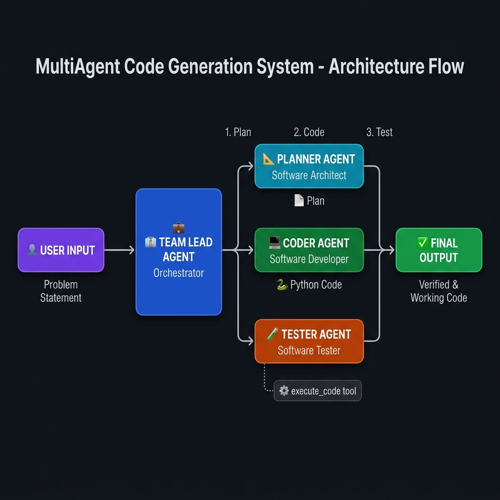

# 🤖 MultiAgent Code Generation System

> A sophisticated **Multi-Agent AI pipeline** powered by **LangChain** and **Mistral AI** that autonomously plans, writes, and tests Python code — mimicking a real software development team.

---

## 📋 Table of Contents

- [Overview](#overview)
- [System Architecture](#system-architecture)
- [Agent Roles](#agent-roles)
- [Code Explanation](#code-explanation)
- [Setup & Installation](#setup--installation)
- [How It Works](#how-it-works)
- [Tech Stack](#tech-stack)
- [Project Structure](#project-structure)

---

## 🌟 Overview

This project implements a **Multi-Agent System** using LangChain that simulates a real software development team:

- 📐 A **Planner Agent** breaks down the problem into a structured plan
- 💻 A **Coder Agent** writes clean Python code from the plan
- 🧪 A **Tester Agent** executes and validates the code
- 👔 A **Team Lead Agent** orchestrates all agents to deliver the final solution

The system demonstrates **agentic AI** — where AI agents collaborate autonomously to solve complex tasks end-to-end.

---

## 🖼️ Architecture Flow Diagram



> **Horizontal I/O Flow:** User Input → Team Lead Agent → Planner / Coder / Tester Agents → execute_code Tool → ✅ Final Output

---

## 🏗️ System Architecture

```
                         ╔══════════════════════════════════════════════════════════════════════════╗
                         ║                        MULTIAGENT CODE GENERATION SYSTEM                  ║
                         ╚══════════════════════════════════════════════════════════════════════════╝

┌─────────────────┐
│   User / Input  │
│                 │
│  "Write Python  │
│   factorial     │
│   function"     │
└────────┬────────┘
         │
         │  Problem Statement
         ▼
┌─────────────────────────────────────────────────────────────────────────────────────────────────┐
│                                     TEAM LEAD AGENT (Orchestrator)                               │
│                                                                                                   │
│   • Receives the problem statement                                                                │
│   • Decides which agents to invoke and in what order                                              │
│   • Manages the overall workflow and coordinates between agents                                   │
│   • Tools Available: [ planner_tool ]  [ coder_tool ]  [ tester_tool ]                           │
└───────────┬───────────────────────────┬───────────────────────────┬─────────────────────────────┘
            │                           │                           │
            │ Step 1: Plan              │ Step 2: Code              │ Step 3: Test
            ▼                           ▼                           ▼
┌───────────────────┐       ┌───────────────────┐       ┌───────────────────┐
│   PLANNER AGENT   │       │   CODER AGENT     │       │   TESTER AGENT    │
│                   │       │                   │       │                   │
│ Role: Software    │       │ Role: Software    │       │ Role: Software    │
│       Architect   │       │       Developer   │       │       Tester      │
│                   │       │                   │       │                   │
│ • Understands the │       │ • Receives the    │       │ • Receives the    │
│   problem         │──────▶│   plan from       │──────▶│   code from       │
│ • Creates a       │  Plan │   Planner         │  Code │   Coder           │
│   structured plan │       │ • Writes clean    │       │ • Tests the code  │
│ • Outlines steps  │       │   Python code     │       │ • Finds bugs      │
│   to solve it     │       │ • Adds comments   │       │ • Validates output│
│                   │       │   & docstrings    │       │ • Uses            │
│ Model: Mistral AI │       │ • Handles edge    │       │   execute_code    │
│ Tools: None       │       │   cases           │       │   tool            │
└───────────────────┘       │                   │       │                   │
                            │ Model: Mistral AI │       │ Model: Mistral AI │
                            │ Tools: None       │       │ Tools:[execute_code│
                            └───────────────────┘       └────────┬──────────┘
                                                                  │
                                                                  │ Executes Code
                                                                  ▼
                                                       ┌───────────────────┐
                                                       │   EXECUTE_CODE    │
                                                       │      TOOL         │
                                                       │                   │
                                                       │ subprocess.run()  │
                                                       │                   │
                                                       │ • Runs Python     │
                                                       │   code safely     │
                                                       │ • Captures stdout │
                                                       │ • Captures stderr │
                                                       │ • Returns result  │
                                                       │ • 30s timeout     │
                                                       └───────────────────┘
                                                                  │
                                                                  │ Test Results
                                                                  ▼
                                              ┌────────────────────────────┐
                                              │         FINAL OUTPUT       │
                                              │                            │
                                              │  ✅ Verified & Working     │
                                              │     Python Code            │
                                              └────────────────────────────┘
```

### 🔄 Data Flow Diagram (Horizontal)

```
[User Input] ──▶ [Team Lead Agent] ──▶ [planner_tool] ──▶ [Planner Agent] ──▶ [Structured Plan]
                        │                                                              │
                        │                    ◀──────────────────────────────────────◀│
                        │
                        ├──────────────────▶ [coder_tool] ──▶ [Coder Agent] ──▶ [Python Code]
                        │                                                              │
                        │                    ◀──────────────────────────────────────◀│
                        │
                        └──────────────────▶ [tester_tool] ──▶ [Tester Agent] ──▶ [execute_code tool]
                                                                      │                     │
                                                                      │◀── Test Results ◀───┘
                                                                      │
                                                              [Final Validation]
                                                                      │
                                                                      ▼
                                                               [✅ Final Output]
```

---

## 👥 Agent Roles

| Agent | Role | Model | Tools | Responsibility |
|-------|------|-------|-------|----------------|
| **Team Lead Agent** | Orchestrator | Mistral AI | `planner_tool`, `coder_tool`, `tester_tool` | Coordinates all agents, manages workflow |
| **Planner Agent** | Software Architect | Mistral AI | None | Breaks problem into structured steps |
| **Coder Agent** | Software Developer | Mistral AI | None | Writes clean, documented Python code |
| **Tester Agent** | Software Tester | Mistral AI | `execute_code` | Tests and validates code execution |

---

## 📖 Code Explanation

### 1. 🔧 Imports & Environment Setup

```python
from dotenv import load_dotenv
load_dotenv()
import os

from langchain_mistralai.chat_models import ChatMistralAI
from langchain.agents import create_agent
import subprocess
import sys
from langchain_core.tools import tool
from langchain.messages import HumanMessage, AIMessage
```

**What this does:**
- `load_dotenv()` — loads the `.env` file to read secret API keys securely
- `os` — gives access to environment variables like `MISTRAL_API_KEY`
- `ChatMistralAI` — connects to Mistral's LLM API for AI reasoning
- `create_agent` — LangChain utility to build an agent with a model + tools + prompt
- `subprocess` — allows running external Python programs safely (used by execute_code tool)
- `sys` — gives access to the current Python interpreter path
- `tool` decorator — marks a function as a LangChain-compatible tool that agents can call

---

### 2. 🤖 Model Initialization

```python
model = ChatMistralAI(
  model="mistral-medium-latest",
  api_key=os.getenv("MISTRAL_API_KEY")
)
```

**What this does:**
- Creates a single **Mistral AI LLM instance** shared across all agents
- Uses `mistral-medium-latest` — a powerful, balanced model for reasoning tasks
- Retrieves the API key securely from the `.env` file (never hardcoded)

---

### 3. 📐 Planner Agent

```python
planner_agent = create_agent(
    model=model,
    tools=[],
    system_prompt="""You are an experienced Software Architect.
    Your task is to understand the problem statement and create a plan to solve the problem."""
)
```

**What this does:**
- Creates an AI agent with the role of a **Software Architect**
- Has **no tools** — it only uses its language understanding to reason and plan
- Receives a problem statement → returns a structured, step-by-step plan

---

### 4. 💻 Coder Agent

```python
coder_agent = create_agent(
    model=model,
    tools=[],
    system_prompt="""
    You are an experienced software developer.
    You write Python code with proper understanding of the problem statement.
    You write code with proper comments and docstrings.
    You think about edge cases and error handling while writing code.
    """
)
```

**What this does:**
- Creates an AI agent with the role of a **Software Developer**
- Also has **no tools** — it reasons and writes code from the given plan
- Focuses on clean code, comments, docstrings, and edge case handling

---

### 5. 🔨 Execute Code Tool

```python
@tool
def execute_code(code: str) -> str:
    result = subprocess.run(
        [sys.executable, "-c", code],
        capture_output=True,
        text=True,
        timeout=30
    )
    return str({
        "stdout": result.stdout,
        "stderr": result.stderr,
        "returncode": result.returncode
    })
```

**What this does:**
- A **LangChain Tool** (decorated with `@tool`) that can be called by agents
- `subprocess.run()` — safely executes Python code as a subprocess
- `sys.executable` — uses the current Python interpreter to run the code
- `capture_output=True` — captures both `stdout` (normal output) and `stderr` (errors)
- `text=True` — returns output as readable strings instead of raw bytes
- `timeout=30` — auto-kills process if it runs longer than 30 seconds (safety guard)
- Returns a dictionary with `stdout`, `stderr`, and `returncode` (0 = success, non-zero = error)

---

### 6. 🧪 Tester Agent

```python
tester_agent = create_agent(
    model=model,
    tools=[execute_code],
    system_prompt="""
    You are an experienced software tester.
    Your task is to test the python code and find out the code is working or not.
    You can use the tool to execute the code and find out the result.
    """
)
```

**What this does:**
- Creates an AI agent with the role of a **Software Tester**
- Has access to the `execute_code` tool — it can actually **run code and see results**
- Validates that the code behaves as expected, catches bugs, and confirms correctness

---

### 7. 🛠️ Agent Tools (Wrappers)

These `@tool`-decorated functions wrap each agent so the Team Lead can call them:

#### `planner_tool(problem_statement: str) -> str`
```python
@tool
def planner_tool(problem_statement: str) -> str:
    response = planner_agent.invoke({
        "messages": [HumanMessage(problem_statement)]
    })
    return response["messages"][-1].content
```
- Sends the problem statement to the **Planner Agent**
- Returns the generated plan as a string

#### `coder_tool(plan: str) -> str`
```python
@tool
def coder_tool(plan: str) -> str:
    response = coder_agent.invoke({
        "messages": [HumanMessage(plan)]
    })
    return response["messages"][-1].content
```
- Sends the plan to the **Coder Agent**
- Returns the generated Python code as a string

#### `tester_tool(code: str) -> str`
```python
@tool
def tester_tool(code: str) -> str:
    response = tester_agent.invoke({
        "messages": [HumanMessage(code)]
    })
    return response["messages"][-1].content
```
- Sends the code to the **Tester Agent** for execution and validation
- Returns the test result and feedback

---

### 8. 👔 Team Lead Agent (Orchestrator)

```python
team_lead_agent = create_agent(
    model=model,
    tools=[planner_tool, coder_tool, tester_tool],
    system_prompt="""
    You are an experienced software team lead.
    Your task is to understand the problem statement and create a plan to solve the problem.
    Then you need to write Python code to solve the problem statement.
    After that, you need to test the Python code and determine whether the code is working correctly or not.
    You can use the available tools to create a plan, write code, and test the code.
    """
)
```

**What this does:**
- The **master orchestrator** of the entire system
- Has access to all three tools: `planner_tool`, `coder_tool`, `tester_tool`
- Autonomously decides the order and how to use each agent
- Drives the entire pipeline from problem → plan → code → tested solution

---

### 9. 🚀 Execution Entry Point

```python
response = team_lead_agent.invoke({
    "messages": [
        HumanMessage("Write a python function to find the factorial of number")
    ]
})
print(response["messages"][-1].pretty_print())
```

**What this does:**
- Kicks off the entire multi-agent pipeline with a single problem statement
- The Team Lead agent autonomously:
  1. Calls `planner_tool` → gets a plan
  2. Calls `coder_tool` → gets Python code
  3. Calls `tester_tool` → validates the code
- Prints the final response from the last message in the conversation

---

## ⚙️ Setup & Installation

### Prerequisites
- Python 3.9+
- A [Mistral AI API Key](https://console.mistral.ai/)

### Steps

```bash
# 1. Clone the repository
git clone https://github.com/hsachan295-source/MultiAgent-Code-Generation-System.git
cd MultiAgent-Code-Generation-System

# 2. Create and activate a virtual environment
python -m venv venv

# On Windows:
venv\Scripts\activate

# On macOS/Linux:
source venv/bin/activate

# 3. Install dependencies
pip install langchain langchain-mistralai python-dotenv

# 4. Set up environment variables
# Create a .env file in the root directory:
echo "MISTRAL_API_KEY=your_api_key_here" > .env

# 5. Run the system
python main.py
```

---

## 🔁 How It Works (Step-by-Step)

```
STEP 1: User provides a natural language problem statement
        └──▶ "Write a Python function to find the factorial of a number"

STEP 2: Team Lead Agent receives the problem
        └──▶ Decides to call planner_tool first

STEP 3: Planner Agent creates a structured plan
        └──▶ "1. Define function factorial(n), 2. Handle base case n=0, 3. Use recursion..."

STEP 4: Team Lead passes plan to Coder Agent via coder_tool
        └──▶ Coder Agent writes clean Python code with docstrings

STEP 5: Team Lead passes code to Tester Agent via tester_tool
        └──▶ Tester Agent calls execute_code tool
        └──▶ subprocess runs the Python code
        └──▶ Returns stdout, stderr, returncode

STEP 6: Team Lead reviews test results
        └──▶ If tests pass → returns final verified code
        └──▶ If tests fail → may ask Coder Agent to fix bugs
```

---

## 🛠️ Tech Stack

| Technology | Purpose |
|------------|---------|
| **Python 3.9+** | Core programming language |
| **LangChain** | Multi-agent framework, tool management |
| **Mistral AI** | LLM backbone for all agents (`mistral-medium-latest`) |
| **python-dotenv** | Secure API key management from `.env` |
| **subprocess** | Safe execution of generated Python code |

---

## 📁 Project Structure

```
MultiAgent-Code-Generation-System/
│
├── main.py               # 🎯 Core multi-agent pipeline
├── architecture_flow.png # 🖼️ Horizontal I/O architecture diagram
├── .env                  # 🔑 API keys (not committed to git)
├── .gitignore            # 🚫 Ignores venv, .env, __pycache__
├── README.md             # 📖 This file
└── venv/                 # 🐍 Virtual environment (not committed)
```

---

## 🔐 Security Note

> ⚠️ **Never commit your `.env` file to Git!**
> Your `MISTRAL_API_KEY` must remain private.
> This project uses `python-dotenv` to load keys locally without exposing them in code.

---

## 🎯 Key Concepts Demonstrated

- **Multi-Agent Architecture** — Multiple specialized AI agents working together
- **Tool Calling** — Agents can invoke tools (functions) to perform real actions
- **Agent Orchestration** — A Team Lead agent coordinates all sub-agents
- **Code Execution Safety** — Using `subprocess` with timeout for safe code running
- **LangChain Framework** — Industry-standard framework for building LLM applications
- **Prompt Engineering** — Each agent has a specialized system prompt defining its role

---

## 📜 License

This project is open source and available under the [MIT License](LICENSE).

---

<div align="center">

**Built with ❤️ using LangChain + Mistral AI**

</div>
